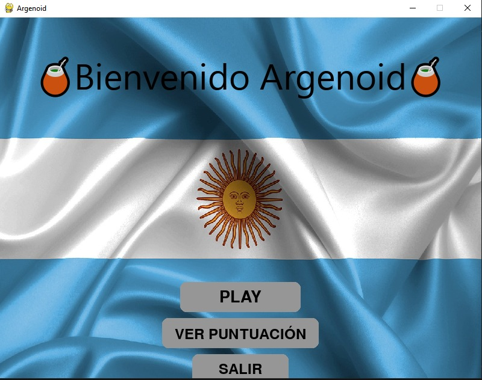
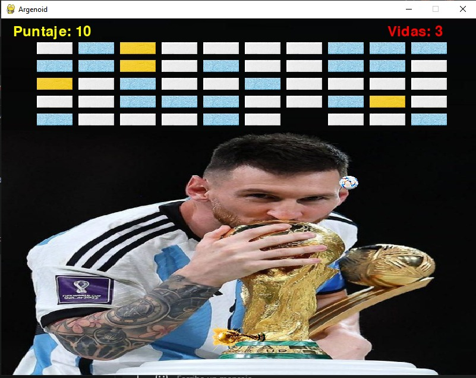
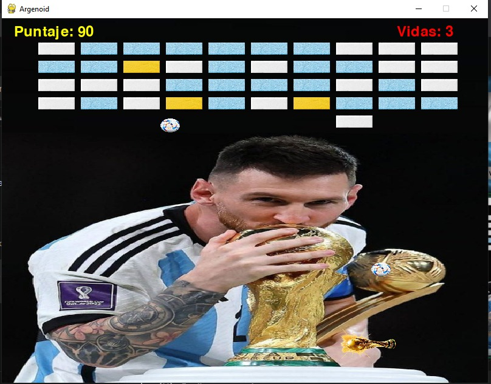
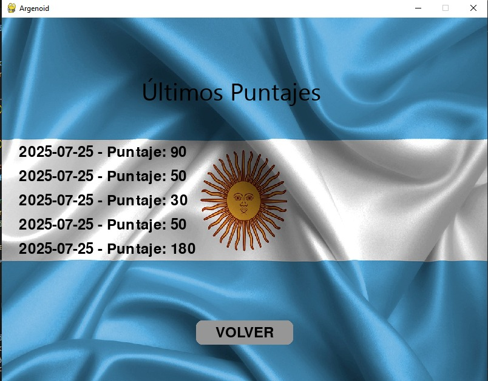

# Argenoid

**Argenoid** es un juego inspirado en el clásico Arkanoid, desarrollado en Python usando Pygame. Tiene temática argentina, con gráficos personalizados, sonidos nacionales y una ambientación animada.

---

## Características

- Juego 2D tipo Arkanoid
- Menú animado con bandera argentina
- Colisiones entre pelota, bloques y paddle
- Sistema de puntaje y vidas
- Música de fondo (Himno Nacional Argentino)
- Efectos de sonido al destruir bloques
- Reutilización de sprites con Pygame

---

## Instrucciones de Uso

1. Clona el repositorio:
```bash
git clone https://github.com/SantiDev03/arkanoid.git
```

2. Instala dependencias:
```bash
pip install pygame
```

3. Ejecuta el juego:
```bash
python app.py
```

---

## Controles del Juego

- 🕹️ Mover paddle: Flechas izquierda y derecha
- 🟢 Iniciar juego: Botón PLAY en el menú
- 🔁 Reiniciar: Botón REINICIAR en pantalla de Game Over
- ❌ Salir: Botón SALIR o cerrar ventana

---

## Capturas del Juego


*Pantalla principal con el menú.*



*Partida en progreso mostrando la pelota, paddle y bloques.*


*Pantalla de Game Over.*


*Pantalla de Puntajes.*

---

## Demo del Juego 🎮

[](https://www.youtube.com/watch?v=e9hnXtgwrak)

*Hace CLICK y mirá cómo se juega Argenoid en este video demostrativo.*

---

## Reglas del Juego

- Usa las flechas izquierda y derecha para mover el paddle.
- La pelota rebota en el paddle y en los bordes de la ventana.
- Debes destruir todos los bloques para ganar el juego.
- Cada bloque destruido suma puntos.
- Algunos bloques amarillos generan una pelota extra cuando los destruyes.
- Tienes 3 vidas para completar el juego.
- Si la pelota cae al fondo y no hay otra pelota, perderás una vida y el juego continuará con una nueva pelota.
- El juego termina cuando se acaben las vidas (¡perdiste!) o cuando destruyas todos los bloques (¡ganaste!).

---

## Recursos Usados

- **Gráficos**: Pelota de fútbol, fondo bandera, fondo de Messi y bloques con texturas realistas
- **Sonidos**:
  - Himno Nacional Argentino (loop en el menú)
  - Efectos tipo Arkanoid al romper bloques

---

## Patrones de Diseño Utilizados

| Patrón de Diseño          | Uso en el Proyecto                                                                                                    |
| ------------------------- | --------------------------------------------------------------------------------------------------------------------- |
| **State**                 | Gestión explícita de estados del juego (`menu`, `jugando`, `game_over`, etc.) para controlar la lógica y renderizado. |
| **Singleton (implícito)** | Uso de instancias únicas globales como `screen` y `clock` para manejar la ventana y la sincronización del juego.      |
| **Factory**               | Creación dinámica y masiva de bloques con bucles, facilitando la generación del escenario de juego.                   |
| **Composición**           | Inyección de dependencias en objetos, como `Ball` recibiendo referencias a `paddle`, `blocks` y grupos de sprites.    |
| **Game Loop**             | Bucle principal que maneja eventos, actualiza estados y renderiza cada fotograma.                                     |
| **Event-driven**          | Manejo de eventos de Pygame para interacción con el usuario, como clicks y teclas presionadas.                        |

---

## Créditos

Desarrolladores:
- Rubén Ledesma
- Rodrigo Espinosa
- Santiago Puebla
- Santiago Romano

---

## Licencia

Este proyecto es libre para uso educativo. Podés modificarlo y adaptarlo según tus necesidades.